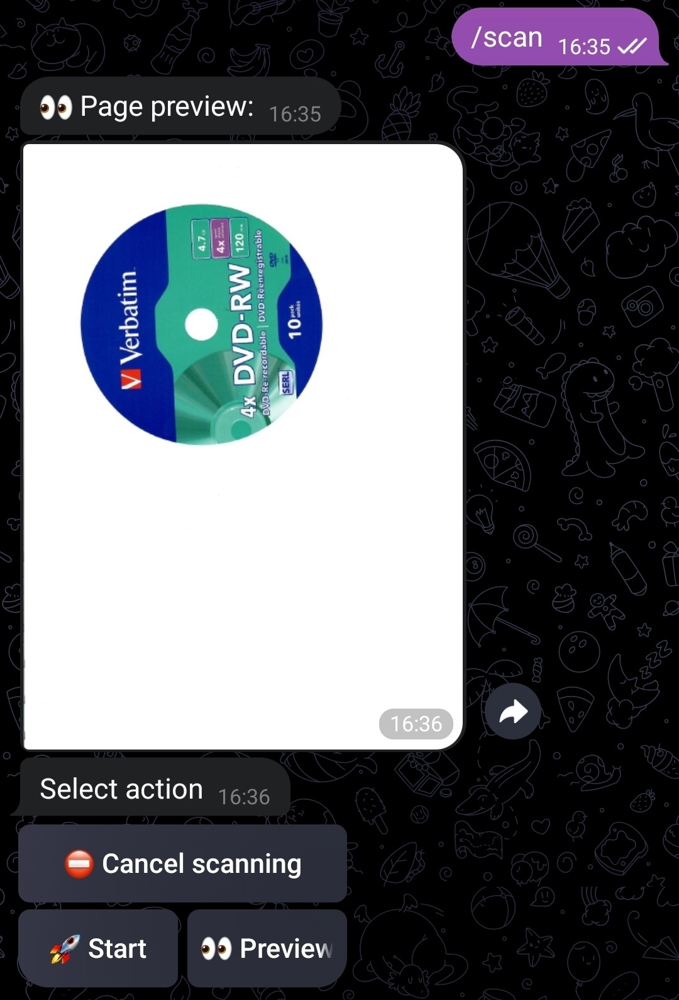
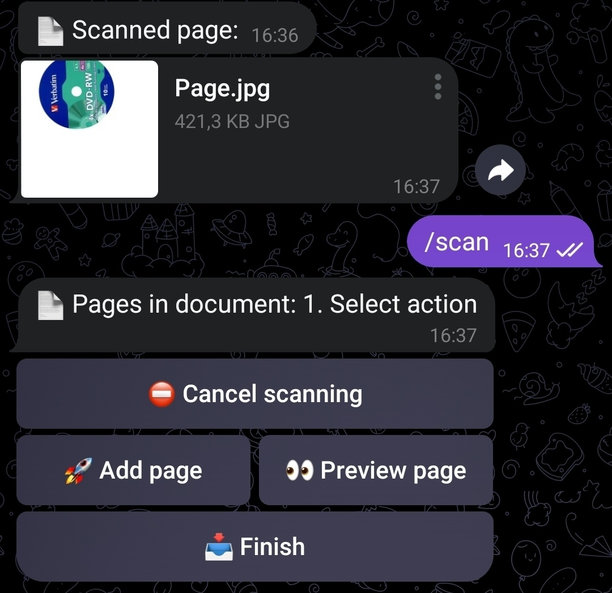
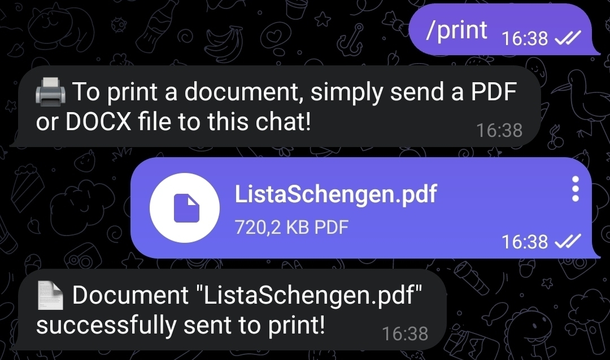

# Mfp3000Bot

An application for printing and scanning from your home printer via Telegram.

One day, I got tired of running back and forth between my laptop and the printer, so I created this tool to work with the MFP from my phone or any other device with a messenger.

## Screenshots

  
  
  

## How to build

To build for the same architecture as your computer, simply run:

```
cargo --build
```

For cross-platform builds, you'll need to use Docker.

For my own needs, I wrote a [build script](build/RPiZero.sh) for Raspberry Pi Zero.

If you're targeting a different platform, you can configure the build yourself using [cross-rs](https://github.com/cross-rs/cross) or create an issue.

## How to run

Mfp3000Bot works on any modern Linux system with [SANE](https://wiki.archlinux.org/title/SANE) and [CUPS](https://wiki.archlinux.org/title/CUPS) configured. You can use the bot only for printing or only for scanning—you don't need a full-fledged MFP at home.

To print DOCX files, you'll also need [LibreOffice](https://www.libreoffice.org/), [unoserver](https://github.com/unoconv/unoserver/), and a set of fonts installed.

The systemd service for Mfp3000Bot is located in [config/mfp3000bot.service](./config/mfp3000bot.service). The service for unoserver can be found at [config/3rd/unoserver.service](./config/3rd/unoserver.service).

## How to configure

The configuration file is located at [config/config.toml](./config/config.toml).

Example configuration:

```toml
[telegram]
token = "Token from @botfather"
allowed_users = ["vklachkov"]
language = "en"

[devices]
printer = "HP_MFP_Home"
# scanner = "escl://192.168.0.29"

[print]
paper_size = "A4"
quality = "Normal"

# [scan]
# preview_dpi = 100
# page_dpi = 300
# page_quality = 75
```

## License

The bot is licensed under the [Apache License 2.0](LICENSE).
